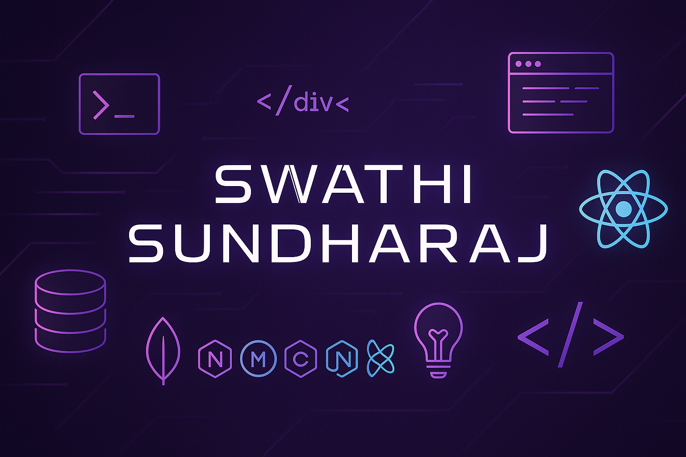

  

<h1  align="center"> Welcome to the &lt Swathi &gt Codebase    </h1>

  

Hi! I'm <strong>Swathi Sundharaj</strong> 🌸 Welcome to my little corner of the internet 👩‍💻

  

<h2>👩‍💻 About Me</h2>

  

<table>

<tr>

<td  width="70%">

<ul>

<li>🚀 Lead Developer at <strong><a  href="https://www.fewinfos.com"  target="_blank">Fewinfos</a></strong></li>

<li>👩‍🎓 Student @ MKCE | B.E CSE </li>

<li>🌱 Learning: React.js, Java</li>

<li>🔭 Remote Intern at <strong>CodeSoft</strong></li>

<li>👯 Collaborating on frontend & AI-based projects</li>

<li>💬 Ask me about: HTML, CSS, JavaScript, Python</li>

</ul>

</td>

<td  align="center">

</td>

</tr>

</table>

  

<h2>🛠 Languages & Tools</h2>

  

  

<h2>🌐 Connect with Me</h2>

  

  

<h2>📊 GitHub Stats</h2>

  

<table>

<tr>

<td>
  
</td>

<td>

</a>

</td>

</tr>

<tr>

<td  colspan="2"  align="center">

  

</tr>

</table>

</table>

  

## ⚡ Activity Graph

  

  

✨ Built with 💻 by <a  href="https://github.com/SwathiSundharaj">Swathi Sundharaj</a>

📝 Last updated on: 

  

<h2  align="center">⚡My Trophies:</h2>

